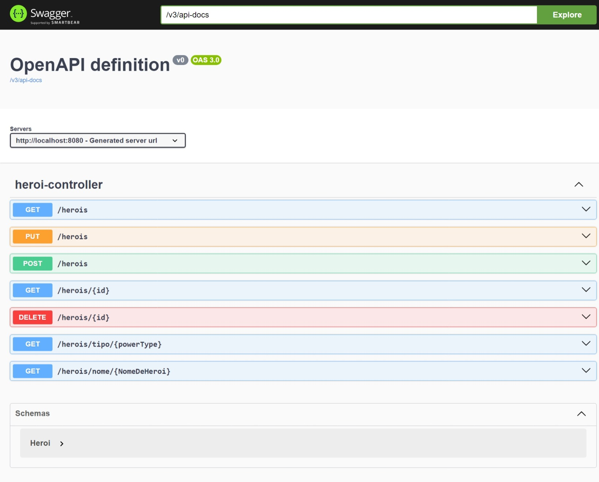

# API de cadastro de heróis

## API REST de cadastro de heróis 

### Índice
* [Preview] (#Preview)
* [Tecnologias] (#Tecnologias)
* [Como usar] (#Como-usar)

## Preview

## Tecnologias

- Spring Boot 3
- Maven
- Spring Web
- Spring JPA
- H2 Database
- Springdoc
- Git e GitHub

## Como usar

- JDK 17 ou +
- Maven
- HTTPie ou outra ferramenta que faça requisições HTTP

### Executando o Projeto

#### Linha de comando
- Na pasta do projeto, execute-o com o comando: mvn spring-boot:run

#### IDE
- Simplesmente execute o projeto na sua IDE favorita

A aplicação estará disponível na porta 8080
Para acessar a documentação swagger basta acessar http://localhost:8080/swagger-ui.html
